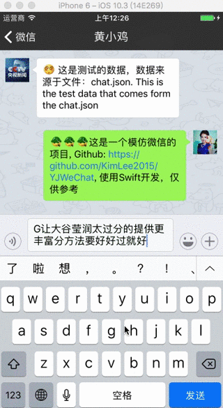

# YJWeChat简介
该项目是业余时间，模仿微信的项目，全部使用Swift3进行开发

# 效果图

# 特色
- 可以发送富文本，表情，图片还有声音。
- `ChatImageCell` 中显示的图片使用 `Mask Layer` 进行绘制，可自由切换聊天背景图
- 自定义表情键盘和工具键盘。
- 录音的 `wav` 文件会被自动转换成 `amr`文件，这样可以方便和 Android 设备进行文件传输。这两种文件都已做了缓存。上传使用 `amr` 文件，播放使用 `wav` 文件。 
- 当你点击`ChatVoiceCell` 的时候，它会自动检测缓存，如果没有那么会使用 [Alamofire](https://github.com/Alamofire/Alamofire) 自动进行下载。
- 当你发送图片的时候，系统会使用 [Kingfisher](https://github.com/onevcat/Kingfisher) 缓存机制存放在本地，上传成功后会自动修改成图片链接的 `MD5` 值文件名字。
- 数据是从 `JSON` 文件里面加载来的, 所有的 `Model` 是使用 [ObjectMapper](https://github.com/Hearst-DD/ObjectMapper) 创建的。

# 文件目录
目录名称|介绍
---|---
Classes|主要存放项目中的不同业务的 `ViewController`，`View` ，`Model` 等文件，子文件夹按照业务逻辑划分。比如按照功能划分有 `Message`,`Address Book`,`Time`,`Me`,`Login` 子目录等
Classes/CoreModule|主要存放一些基础类库的业务逻辑的封装，比如`Network`,`Socket 引擎`,`Model文件夹`等
General|这个目录放会被重用的 Views/Classes 和 Categories，存放`和业务逻辑`相关的 `class`，比如颜色的分类，
Helpers|存放一些非业务逻辑的类或者 category
Macro|存放整个应用会用到的宏定义，常量名等，比如 `Notifications`名称，`页面 title 名称`，第三方库所使用的 key 等
Resources|存放资源文件，包括`Assets.xcassets`,`Media.xcassets`，`音频文件`，`plist 文件` 等
Vendor|存放一些第三方库，尽量使用`cocoapods`来管理，万不得已可以存放在这里
Supporting Files|项目原有的目录
